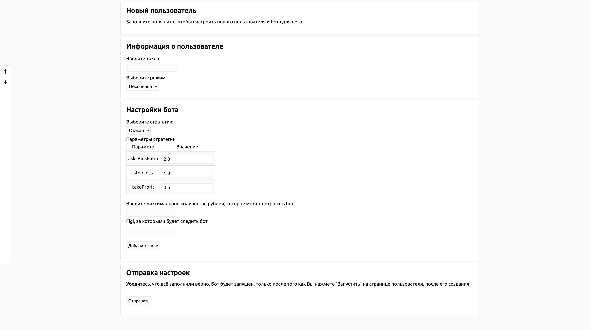
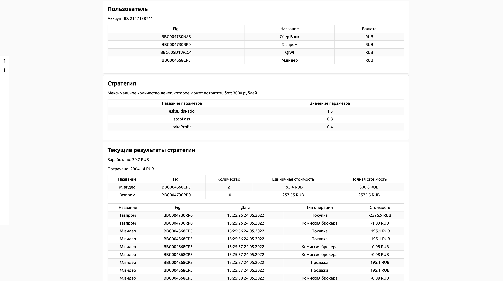
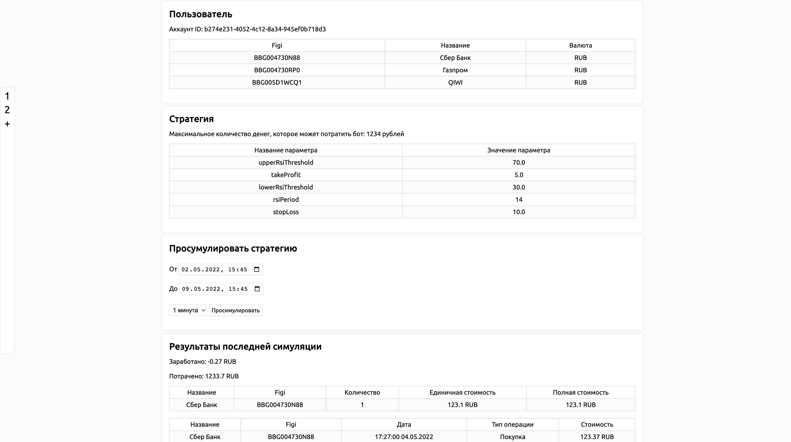

# Tinkoff Trade Botfather

Приложение для создания, анализа и тестирования стратегий,
использующее [Tinkoff Инвестиции](https://www.tinkoff.ru/invest/).

**Предупреждение:** приложение не гарантирует дохода от Тинькофф Инвестиций.

### Использованный стек технологий

* [Java SDK Tinkoff Invest](https://github.com/Tinkoff/invest-api-java-sdk) - получение всей необходимой информации о
  бумагах,
  выставление заявок на биржу, получение информации о пользователе
* [Spring](https://spring.io/) - основной framework приложения
* [Caffeine](https://github.com/ben-manes/caffeine) - библиотека для кэширования запросов к API
* [Thymeleaf](https://www.thymeleaf.org/) - framework для генерации HTML страницы по шаблону
* [Lombok](https://projectlombok.org/) - библиотека упрощающая код

### Что умеет?

* Режим анализа: тестируйте свои смелые догадки, не дожидаясь открытия торгов и не тратя свои деньги. Выберите стратегию,
интересный Вам временной промежуток и вперёд!
* Работать одновременно с несколькими пользователями. Вы можете одновременно торговать на реальной бирже стратегиями, в которых Вы уверены,
  торговать в режиме песочницы оставшимися и изобретать новые в режиме анализа.
* Устали от непонятных консольных приложений? У нас приятный и удобный веб-интерфейс!

### Требования перед запуском приложения

* Установленная виртуальная Java машина (JVM) версии 17 и выше.
  Скачать: [OpenJDK 17](https://jdk.java.net/java-se-ri/17)
  или [Oracle](https://www.oracle.com/java/technologies/downloads/).
* Аккаунт в Тинькофф инвестициях (желательно, с включенной маржинальной торговлей) и токен для API запросов.
    * Официальная [инструкция](https://tinkoff.github.io/investAPI/token/) по получению токена.
    * Прямая [ссылка](https://www.tinkoff.ru/invest/settings/api/).
* Стабильное Интернет-соединение.

### Запуск приложения

1. Скачайте [последний релиз приложения](https://github.com/UncleSema/ttb/releases).
2. Запустите TinkoffTradeBot.jar через командную строку: `java -jar TinkoffTradeBot.jar`.
3. Перейдите в браузере по адресу `localhost:8080`

Чуть более долгий способ:

1. Склонируйте репозиторий: `git clone https://github.com/UncleSema/ttb`
2. Запустите приложение: `./gradlew bootRun`
3. Перейдите в браузере по адресу `localhost:8080`

### Что дальше?

После запуска приложения вы должны оказаться на странице создания нового пользователя



1. Получите токен Тинькофф Инвестиций и вбейте его в поле "Токен".
2. Выберите режим: работа в песочнице, работа на реальной бирже
   или режим симуляции работы стратегии на исторических данных.
3. Если вы собираетесь работать на реальной бирже, введите accountId (в других режимах сервис будет создавать новый
   Sandbox аккаунт
   и брать accountId, которое генерирует Api Tinkoff Инвестиций).
4. Выберите стратегию, с которой собираетесь работать (в анализ-режиме доступны только стратегии, работающие со свечами,
   т.к. из api нельзя получить исторические стаканы).
5. Настройте стратегию.
6. Выберите максимальное количество денег (в рублях), которое сможет потратить стратегия.
7. Выберите бумаги, с которыми будет работать бот (введите их FIGI).

Далее вы окажетесь на странице пользователя, где вы сможете увидеть выбранные параметры, а так же запустить стратегию,
нажав на соответствующую кнопку (если что-то пошло не так, вы можете экстренно продать по рыночной цене все бумаги,
которые купила стратегия, нажав на соответствующую кнопку).



### Как добавить свою стратегию?

Для этого достаточно реализовать нужный
интерфейс: [стратегии, использующей стакан](https://github.com/UncleSema/ttb/blob/main/src/main/java/ru/unclesema/ttb/strategy/OrderBookStrategy.java)
,
или [стратегии, использующей свечи](https://github.com/UncleSema/ttb/blob/main/src/main/java/ru/unclesema/ttb/strategy/CandleStrategy.java)
.
Причем Вы можете реализовать оба интерфейса: использовать и стакан, и свечи.

"Добавить стратегию" значит:

1. При поступлении новой свечи / стакана, сказать стоит ли идти в лонг / в шорт.
2. Добавить параметры, которые Вы бы хотели видеть и настраивать через UI.
3. Добавить уникальное имя стратегии, чтобы выбирать её через UI.

Примеры
стратегий: [на стакане](https://github.com/UncleSema/ttb/blob/main/src/main/java/ru/unclesema/ttb/strategy/orderbook/AsksBidsStrategy.java)
,
[на свечах](https://github.com/UncleSema/ttb/blob/main/src/main/java/ru/unclesema/ttb/strategy/rsi/RsiStrategy.java).

**Важно:** для того, чтобы стратегия была доступна при выборе через UI, её нужно добавить
в [ApplicationModule](https://github.com/UncleSema/ttb/blob/main/src/main/java/ru/unclesema/ttb/ApplicationModule.java)
в метод
*availableCandleStrategies*. Там уже добавлены стратегии, работающие на стакане и на свечах.

### Удобный способ создания пользователя при старте

Очень часто, например при deploy, у нас нет возможности / желания заходить в браузер, создавать там нового пользователя
и включать стратегию для него. В приложении реализован способ создать при старте нового пользователя и, при желании,
запустить
для него стратегию. Для этого нужно запустить приложение с параметрами вида:

```
java -jar TinkoffTradeBotfather.jar \
--user.token=<TOKEN> \
--user.mode=<MODE> \
--user.account-id=<ACCOUNT_ID> \
--user.figis="<FIGI1>,<FIGI2>..." \
--user.max-balance=<MAX_BALANCE> \
--user.strategy-parameters.name=<STRATEGY_NAME> \
--user.strategy-parameters.parameter1=<VALUE1> \
--user.strategy-enable=<STRATEGY_ENABLE>
```

Пример правильной команды:

```
java -jar TinkoffTradeBotfather.jar \
--user.token='t.123' \
--user.mode='SANDBOX' \
--user.figis="BBG004730N88,BBG004730RP0" \
--user.max-balance=3000 \
--user.strategy-parameters.name='Стакан' \
--user.strategy-parameters.takeProfit=0.4 \
--user.strategy-enable=true
```

После выполнения данной команды будет создан *SANDBOX* пользователь с токеном *t.123*, балансом *3000* рублей, с *автоматически
включенной* стратегией *'Стакан'*, у которой параметр *takeProfit = 0.4* (остальные параметры по-умолчанию), следящей за
бумагами *Газпром* и *Сбербанк*.

Так же можно настроить автоматическое создание пользователя
в [конфигурации приложения](https://github.com/UncleSema/ttb/blob/main/src/main/resources/application.yaml).
[Пример создания пользователя аналогичному пользователю выше через конфигурацию приложения](https://github.com/UncleSema/ttb/blob/main/src/main/resources/application.yaml)
.

### Режим анализа 

Очень часто трейдерам не хочется ждать открытия торгов и/или тратить свои деньги, а протестировать стратегию хочется.
Для этого в приложение добавлен режим анализа. 

1. На странице пользователя выберите режим анализа.
2. Выберите стратегию для анализа (можно выбрать только стратегии, использующие свечи, т.к. Тинькофф Инвестиции не поддерживают
получение исторических стаканов).
3. На странице пользователя выберите временной промежуток для анализа и размер свечей (чем более маленькие свечи, тем более точный анализ).
4. Нажмите "Просимулировать".

На странице пользователя будут показаны результаты последней симуляции стратегии в том формате, в котором они представляются во 
время торговли на бирже.

**Важно:** не делайте временной промежуток слишком большим, так как время получения свечей из API может значительно увеличиться.



### В дальнейших планах

* Добавить графики при помощи Google Charts и JavaScript
